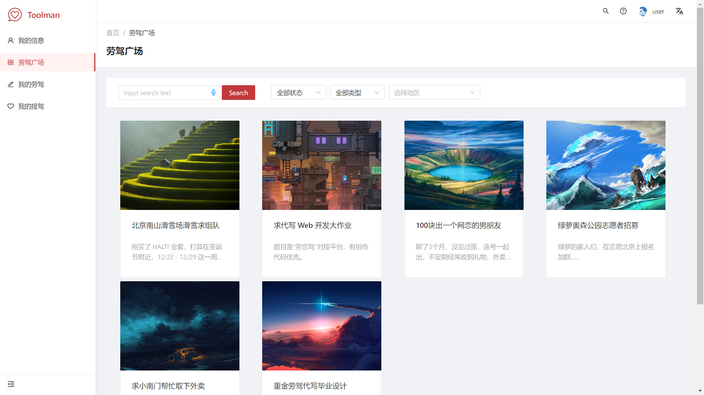

# Toolman-Front

Make Toolman Great Again !!!



## Frameworks

- React
- UmiJS
- Ant Design
- Ant Design Pro

## Deploy

- Nginx
- Docker
- Docker-Compose

Upload to docker(windows):

```bash
deploy.bat
```

Deploy on sever:

```
docker pull ...
docker-compose up -d
```

## Environment Prepare

Install `node_modules`:

```bash
yarn
```

## Provided Scripts

Toolman provides some useful script to help you quick start and build with web project, code style check and test.

Scripts provided in `package.json`. It's safe to modify or add additional script:

### Start project

```bash
yarn start
```

### Build project

```bash
yarn build
```

### Check code style

```bash
yarn lint
```

### Test code

```bash
yarn test
```

## More

You can view full document on our [official website](https://github.com/Call-Toolman).
